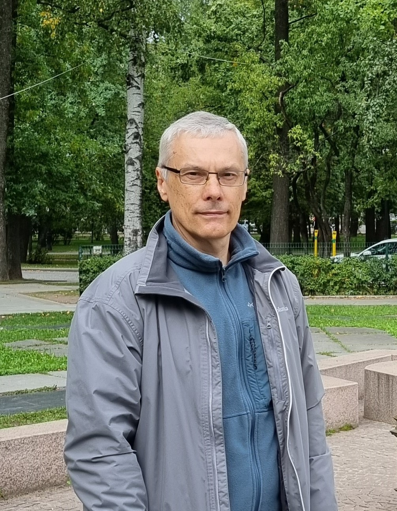

# Резюме
Сёменов Василий Васильевич

1. Год рождения: 1971
2. Образование высшее
3. Последнее место работы "Либхерр-русланд". Стаж 10 лет 10месяцев. Должность инженер КИПиА
4. Без вредных привычек
5. Регулярное заняти физкультурой и спортом 

